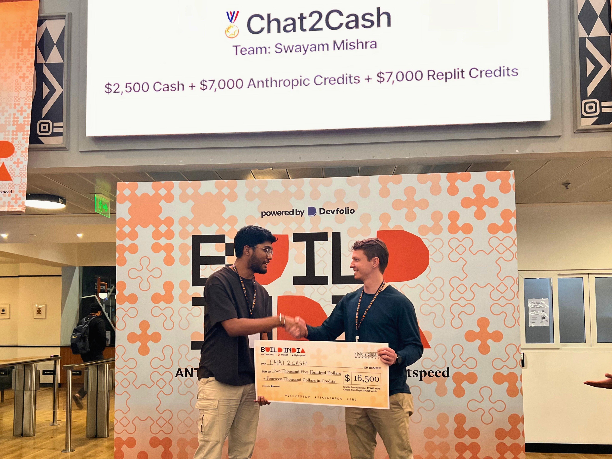

<div align="center">

# 🏆 Build India Hackathon Winner (1st Place)
**Organized by Anthropic × Replit × Lightspeed**

</div>

---

# Chat2Cash 

> **AI-powered revenue recovery system for India's WhatsApp-first businesses.**
> 
> _Transforming messy "Hinglish" chat logs into structured orders, invoices, and actionable business intelligence._

## The Story

**60 million SMBs in India run their businesses on WhatsApp.** But WhatsApp is a chat app, not an operating system.

I built this project watching my mother run her clothing business. Every day, she would lose 10-15% of her potential revenue because orders got buried in chat threads, follow-ups were forgotten, and payments were missed. Manual entry into Excel at 11 PM was the only solution—until now.

**Chat2Cash is an AI operations layer that sits on top of WhatsApp.** It automatically reads messy conversations, extracts structured order details, handles inventory queries, and generates GST-compliant invoices in one click.

---

## Key Features

### Advanced AI Extraction (Claude 3.5 Sonnet)
- **Hinglish Mastery**: Understands "2 kilo aaloo", "bhaiya red wala dikhao", and mixed-language intents.
- **Context Aware**: Distinguishes between inquiries ("price kya hai?") and confirmed orders ("book kar do").
- **Smart Parsing**: Extracts items, quantities, units, delivery dates, and special instructions from unstructured text.

### Enterprise-Grade Distributed Architecture
- **Decoupled API & Worker Tiers**: Horizontally scalable architecture where the API server handles HTTP requests, while dedicated worker nodes process heavy AI extraction and webhooks independently.
- **Robust Queueing**: Uses **BullMQ & Redis** with AOF (Append Only File) persistence enabled to guarantee zero job loss during crashes.
- **Multi-Queue System**: Dedicated processors for Extraction jobs and Webhook deliveries.
- **Data Layer**: Built on **PostgreSQL** with **Drizzle ORM** for type-safe, normalized data storage.

### Security & Observability 
- **Tracing & Error Tracking**: Integrated with **Sentry** for real-time error monitoring and crash reporting.
- **Structured Logging**: Uses Pino with auto-generated **Correlation IDs** to trace requests seamlessly across the API and worker boundaries.
- **Security Headers & Sanitization**: Secured via `Helmet`, input sanitization to prevent injection attacks, and strict rate limiting.
- **PII Redaction**: Middleware automatically masks phone numbers and names in logs/responses for privacy compliance.

### Instant Invoicing
- **One-Click Generation**: Converts chat data into professional PDF invoices using `PDFKit`.
- **GST Compliant**: Automatically calculates CGST/SGST/IGST breakdowns.
- **Sequential Numbering**: Manages invoice sequences automatically.

---

## Tech Stack

- **Runtime**: Node.js & TypeScript
- **Framework**: Express.js
- **Database**: PostgreSQL
- **ORM**: Drizzle ORM
- **Queue/Cache**: Redis & BullMQ
- **AI Engine**: Anthropic Claude 3.5 Sonnet
- **Observability**: Sentry & Pino (with Correlation IDs)
- **Security**: Helmet, Zod validation
- **PDF Generation**: PDFKit

---

## API Reference

### Core Operations
| Method | Endpoint | Description |
| :--- | :--- | :--- |
| `POST` | `/api/extract` | Extract order from a single message (Sync) |
| `POST` | `/api/extract-order` | Extract order from full chat history (Sync) |
| `POST` | `/api/generate-invoice` | Generate PDF invoice for an order |

### Async Operations (Background Jobs)
| Method | Endpoint | Description |
| :--- | :--- | :--- |
| `POST` | `/api/async/extract` | Queue single message extraction |
| `POST` | `/api/async/extract-order` | Queue chat log extraction |
| `GET` | `/api/jobs/:id` | Check status of background job |

### Data & Management
| Method | Endpoint | Description |
| :--- | :--- | :--- |
| `GET` | `/api/orders` | List all orders (Pagination supported) |
| `GET` | `/api/orders/:id` | Get specific order details |
| `PATCH` | `/api/orders/:id` | Update order status |
| `DELETE` | `/api/orders/:id` | Soft delete an order |

### System
| Method | Endpoint | Description |
| :--- | :--- | :--- |
| `GET` | `/api/health` | System health check (DB, Redis, AI) |
| `GET` | `/api/queue/health` | Queue metrics (Waiting, Active, Failed) |

---

## Getting Started

### Prerequisites
- Docker & Docker Compose (Recommended)
- Node.js v18+ (for local development)
- PostgreSQL Database
- Redis Server (for async queues)
- Anthropic API Key
- Sentry DSN (Optional, for error tracking)

### Installation (Docker - Recommended)

The easiest way to run the full distributed stack (Database, Redis, API, and Workers) is via Docker Compose:

1. **Clone the repository**
``` bash
git clone [https://github.com/yourusername/chat2cash.git]
cd chat2cash
``` 

2. **Environment Setup** Create a `.env` file in the root:

``` Code snippet
ANTHROPIC_API_KEY="sk-ant-api03-..."
SENTRY_DSN="https://your-sentry-dsn@sentry.io/..." # Optional
DEFAULT_BUSINESS_NAME="My Saree Shop"
DEFAULT_GST_NUMBER="22AAAAA0000A1Z5"
```

3. **Run the Stack**

``` Bash
docker-compose up --build
```

_Note: The `docker-compose.yml` automatically scales the worker tier to 2 replicas out of the box._

### Manual Installation

1. **Install Dependencies**

``` Bash
npm install
```

2. **Environment Setup** (Add standard DB and Redis URLs to your `.env` alongside the variables above)

3. **Database Migration** 
``` bash
npm run db:push
```
4. **Run the API Server**
```bash
npm run dev
````

5. **Run the Worker Node** (In a separate terminal)
``` Bash
npm run dev:worker
```

---
## Project Structure

```
src/
├── config/         # DB, Env, Sentry, and App Configs
├── controllers/    # Request Handlers
├── middlewares/    # Error Handling, Sentry, Logging (Correlation IDs), PII Redaction
├── routes/         # API Route Definitions
├── services/       # Business Logic (AI, PDF, Queue, Storage)
├── index.ts        # API Entry Point
├── worker.ts       # Standalone Worker Entry Point
└── schema.ts       # Drizzle ORM Schema & Zod Types
```

---
## Contributing

Contributions are welcome!

1. Fork the Project
    
2. Create your Feature Branch (`git checkout -b feature/AmazingFeature`)
    
3. Commit your Changes (`git commit -m 'Add some AmazingFeature'`)
    
4. Push to the Branch (`git push origin feature/AmazingFeature`)
    
5. Open a Pull Request
    

---

_Built with ❤️ for the 60 million SMBs of India._